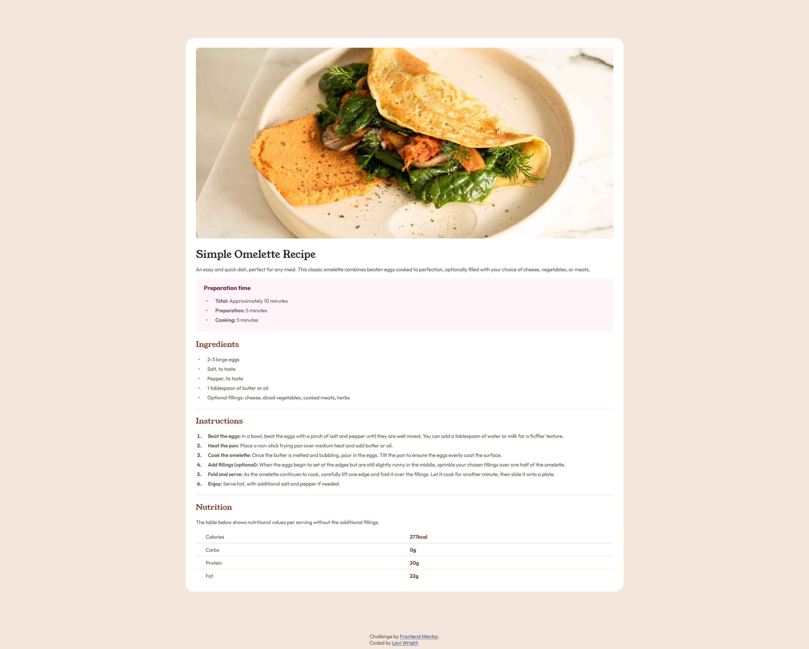

# Frontend Mentor - Recipe Page Solution

This is my solution to the [Recipe Page challenge on Frontend Mentor](https://www.frontendmentor.io/challenges/recipe-page-KiTsR8QQKm). Frontend Mentor challenges help you improve your coding skills by building realistic projects. 

## Table of contents

- [Overview](#overview)
  - [Screenshot](#screenshot)
  - [Links](#links)
- [My process](#my-process)
  - [Built with](#built-with)
  - [What I learned](#what-i-learned)
  - [Continued development](#continued-development)
- [Author](#author)

## Overview

### Screenshot



### Links

- Solution URL: [Frontend Mentor](https://www.frontendmentor.io/solutions/recipe-page-with-mobile-first-design-and-semantic-html-anhaWFucbK)
- Live Site URL: [GitHub Pages](https://law973.github.io/recipe-page/)

## My process

### Built with

- Semantic HTML
- CSS variables
- Mobile-first workflow and media queries

### What I learned

I learned how to create unordered lists with bullet points that are vertically centered even when list items span multiple lines (as opposed to using the default bullet points that line up with the first line of a list item). 

Changing the display style for the list items of an unordered list removes their default display style (list-item), which in turn removes the default bullet points. With the new display style, flex, items (and hence the new bullet point) can then be aligned to the center:

```css
ul li {
  align-items: center;
  display: flex;
}
```

With the default bullet removed and list items now being centered vertically, the custom bullet is then created:

```css
ul li::before {
  color: var(--brown-800);
  content: "\2022";
  margin-right: 24px;
}
```

Also, when testing the site on my phone, I discovered that Safari will sometimes enlarge text if it thinks it may be too small. Due to this, when putting the phone into landscape orientation, the text of the paragraph elements and the ordered list ended up much larger than it should have been and was inconsistent with the rest of the page. I was able to solve this issue with some lines that deal with "text-size-adjust":

```css
text-size-adjust: 100%;
-moz-text-size-adjust: 100%;
-webkit-text-size-adjust: 100%;
}
```

### Continued development

Building this project has helped me to realize that I would like to continue working with ordered/unordered lists and tables more often so that I can become more familiar with their default structures and style them faster.

## Author

- Website - [Levi Wright](https://luxury-flan-09fd6a.netlify.app/)
- Frontend Mentor - [@law973](https://www.frontendmentor.io/profile/law973)
- LinkedIn - [Levi Wright](https://www.linkedin.com/in/levi-arthur-wright/)
- GitHub - [@law973](https://github.com/law973)
